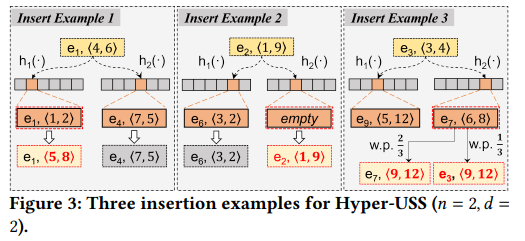

[TOC]
```
vscode 下载markdown preview enhanced插件再打开预览可生成目录
```
# 工作总结与反思
## 2023.9.30
- 本周工作
  - 完善文档
## 2023.10.6
- 本周工作
  - 完善文档
---
# sketch算法比较
## 全流频率估计
- 给定网络流，提供每个流的频率估计。
### Count-Min Sketch
- 参考文献
>[Cormode G, Muthukrishnan S. An improved data stream summary: the count-min sketch and its applications[J]. Journal of Algorithms, 2005, 55(1): 58-75.](../references/An%20improved%20data%20stream%20summary.pdf)
- 数据结构：二维计数器数组
  
- 插入算法：将元素通过多个hash函数映射到多个计数器，并将对应的计数器加一
- 查询算法：选取多个计数器中的最小者
- 局限：
  1. 不适应真实网络流，其流的频率通常高度倾斜。因此，CM Sketch必须为每个计数器分配足够的位数，在实际场景中浪费了大量内存
  2. 由于哈希冲突，不同的流可能存储在相同的空间中，从而导致小流和大流之间的误分类，这导致小流的误差很高
### Conservative-Update Sketch
- 参考文献
>[Estan C, Varghese G. New directions in traffic measurement and accounting: Focusing on the elephants, ignoring the mice[J]. ACM Transactions on Computer Systems (TOCS), 2003, 21(3): 270-313.](../references/New%20Directions%20in%20Traffic%20Measurement%20and%20Accounting.pdf)
- 数据结构：与CM相同，二维计数器数组
- 插入算法：将元素通过多个hash函数映射到多个计数器，但是只将最小的计数器加一
- 查询算法：选取多个计数器中的最小者
- 创新
  1. 保守更新策略，只对最小值更新，误差累计慢
  
- 局限
  1. 不支持删除操作

### Count-Mean-Min Sketch
- 参考文献
>[Deng F, Rafiei D. New estimation algorithms for streaming data: Count-min can do more[J]. Webdocs. Cs. Ualberta. Ca, 2007.](../references/New_estimation_algorithms_for_streaming.pdf)
- 数据结构：与CM Sketch相同，二维计数器数组
- 插入算法：与CM Sketch相同，将元素通过多个hash函数映射到多个计数器，对这些计数器加一
- 查询算法：尝试估计每个计数器的噪声，并去除噪声得到余量，返回d个余量的中位数。噪声可以计算为除计数器CM[i，hi（q）]本身之外的行i中所有计数器的平均值。即噪声估计为（N-CM[i，hi（q）]）/（w-1），其中N是流大小，w是草图宽度。
- 特点：通过估计噪声实现无偏估计
### Augmented Sketch
- 参考文献
>[Roy P, Khan A, Alonso G. Augmented sketch: Faster and more accurate stream processing[C]//Proceedings of the 2016 International Conference on Management of Data. 2016: 1449-1463.](../references/Augmented%20Sketch%20Faster%20and%20More%20Accurate.pdf)
- 数据结构：在现有的Sketch（如CM）上使用一个附加的过滤器（其中包含计数器）来尽早聚合大流，而Sketch处理分布的尾部小流。
  
- 插入算法：
  
- 查询算法：
- 特点
    1. 利用底层网络流的偏斜性来通过尽早将大流和小流分离开，防止它们被错误分类，从而提高最频繁流的准确性。
- 局限
    1. 在插入过程中，它会导致Sketch和过滤器之间的许多交换，从而大大降低速度。

### Elastic Sketch
- 参考文献
>[Yang T, Jiang J, Liu P, et al. Elastic sketch: Adaptive and fast network-wide measurements[C]//Proceedings of the 2018 Conference of the ACM Special Interest Group on Data Communication. 2018: 561-575.](../references/Elastic%20Sketch%20Adaptive%20and%20Fast%20Network-wide.pdf)
- 数据结构：一个哈希桶阵列和一个底层的Sketch。哈希桶阵列用于存储较大的流，而底层的Sketch用于存储较小的流。当流被插入时，首先尝试将其插入哈希桶。如果哈希桶的位置被占，流将被送入底层的Sketch。它通过投票驱逐策略更新哈希桶里的元素。
  
- 亮点
  1. Elastic Sketch通过将大流和小流分开存储，降低了大流的估计误差。查询大流时较快。
- 局限
  1. 因为sketch和上层的哈希桶只能单向交换，一旦将某个大流误报为小流进入sketch，就再也无法回到哈希桶了，导致该大流的估计精度受到影响。
### One Memory Access Sketch
- 参考文献
>[Zhou Y, Liu P, Jin H, et al. One memory access sketch: a more accurate and faster sketch for per-flow measurement[C]//GLOBECOM 2017-2017 IEEE Global Communications Conference. IEEE, 2017: 1-6.](../references/One%20Memory%20Access%20Sketch.pdf)
- 解决了什么问题？
  固定内存下实现高准确和高速度的频率估计。
- 为什么解决这个问题？
  - 传统的Sketch在固定内存大小的情况下，它们不能同时实现高准确性和高速度。一是内存利用不适应高倾斜的网络流，二是多次内存访问与哈希计算不适应网络流的快速速度。
- 如何解决问题的？ 
  - 利用基于分层结构的字约束和指纹技术。小计数器大小的较低层主要记录小鼠流的信息，而具有相对较大计数器大小的较高层主要记录大象流的信息。底层溢出会向上进位。
 
- 亮点、局限
  -亮点
    - 单词约束和一次哈希技术能实现接近O(1)的时间插入和查询
    - 分层动态存储大流和小流
  - 局限
     - 高频统计时较坏情况下要多次内存访问
### Pyramid Sketch
- 参考文献
>[Yang T, Zhou Y, Jin H, et al. Pyramid sketch: A sketch framework for frequency estimation of data streams[J]. Proceedings of the VLDB Endowment, 2017, 10(11): 1442-1453.](../references/Pyramid%20sketch.pdf)
- 解决了什么问题？
  - Pyramid Sketch解决了网络流量测量中的频率估计问题，特别是在不了解大流频率的情况下，避免计数器溢出，同时实现高精度和高吞吐量。
- 为什么解决这个问题？
  - 在网络流量监控和异常检测等应用中，频率估计是一项关键任务。然而，在不了解大流频率的情况下，传统的Sketch方法可能会导致计数器溢出，从而影响估计的准确性。Pyramid Sketch通过使用分层数据结构来解决这个问题，从而实现更准确的频率估计。
- 如何解决问题的？  
  - 一个具有多层的分层数据结构。第i层的计数器数量是第i-1层的一半。第一层是一个普通的sketch（类似于CM），只有纯计数器，第二层及以上是混合计数器，用于自动进位。使用此结构，它不仅可以防止计数器在不事先知道大流频率的情况下溢出，而且可以同时实现高精度和高吞吐量。


- 亮点、局限
  - 亮点：
     - 使用分层数据结构来动态容纳大流和小流，避免计数器溢出。
     - 同时平均实现接近O(1)的时间插入和查询（单词约束->一次访问内存，一次哈希->一次哈希运算）
  - 局限
     - 查询大流时需要访问多个层次，导致内存访问次数增加。这大大降低了速度，难以进行top-k估计
### Cold Filter
- 参考文献
>[Zhou Y, Yang T, Jiang J, et al. Cold filter: A meta-framework for faster and more accurate stream processing[C]//Proceedings of the 2018 International Conference on Management of Data. 2018: 741-756.](../references/cold%20filter.pdf)
- 解决了什么问题？
  - 流式数据处理中如何在有限的内存空间和时间开销下，快速而准确地估计每个流的特征。
- 为什么解决这个问题？
  - 流式数据处理面临两个挑战：一是数据流巨大，无法完全存储或者排序；二是数据分布不均匀。这导致原有的sketch无法同时达到高精度和高速度的目标
- 如何解决问题的？ 
  - 利用一个两层的结构，第一层用于过滤冷门项，第二层用来处理热门项。
 

- 亮点、局限
  - 亮点
    固定内存空间和时间开销下显著提升了流式数据处理的速度与精度。
  - 局限
### Cuckoo filter
- 参考文献
>[Fan B, Andersen D G, Kaminsky M, et al. Cuckoo filter: Practically better than bloom[C]//Proceedings of the 10th ACM International on Conference on emerging Networking Experiments and Technologies. 2014: 75-88.](../references/Cuckoo%20Filter%20Practically%20Better%20Than%20Bloom.pdf)
- 解决了什么问题？
  - 确定给定项是否在集合中。
- 为什么解决这个问题？
  - 传统Bloom过滤器不支持删除，改进后支持删除的Bloom过滤器会占用更大的空间或者影响性能。
- 如何解决问题的？
  - 先介绍cuckoo hash
  

  - 在cuckoo hash的基础上，1.存储指纹而不是原值；2.计算备用位置时异或。  
  - 只用一个桶（左）
  - 对数组进行展开，可以放4个元素，在发生冲突前显著提升空间利用率。（右）
  

- 亮点、局限
  - 亮点：
     - Cuckoo Filter不仅支持添加和查询操作，还支持删除操作。而传统Bloom过滤器在这方面的表现不佳。
     - 高空间利用率：Cuckoo Filter可以将多个元素存储在一个桶中，提高了空间利用率。而扩容后更是在发生冲突前显著提升空间利用率。
  - 局限
     - 处理冲突的性能开销：在一些情况下，可能会发生多次置换，导致计算开销增加。
  
### Cuckoo counter
- 参考文献
>[Shi Q, Xu Y, Qi J, et al. Cuckoo Counter: Adaptive Structure of Counters for Accurate Frequency and Top-k Estimation[J]. IEEE/ACM Transactions on Networking, 2023.](../references/Cuckoo%20Counter%20Adaptive%20Structure%20of%20Counters.pdf)
- 解决了什么问题？
  - 解决了网络流量测量中的频率估计和top-k流的识别问题，具有内存高效、高速度、高精度和高准确度的特点。
- 为什么解决这个问题？
  - 由于现实网络流的不平衡分布，很少有适用于估计频率和查找top-k流的数据结构。难点主要在于同时保证频率估计、前k个估计的速度、误差和精度。
- 如何解决问题的？
  - 使用与Cuckoo哈希类似的数据结构，由m个以特定方式组织的桶和每个桶中具有不同大小的B个条目组成（entry i的大小随i的增加而增加）。每个条目是类似于<fingerprint，frequency>的键值对。每个数据包由其fingerprint进行标识。

  
- 亮点、局限
  - 亮点
     - 使每个桶的访问时间复杂度为O(1)，在桶内线性遍历，因此在更新期间实现了高吞吐量
     - 利用底层网络流的偏斜性。当发生溢出时，CC尝试将流重新定位到同一桶中更大的条目中（仍在一个内存访问中），以保证大流放置在大型条目中，小流放置在小型条目中。
     - 实现了高内存利用率。当发生冲突时，CC利用Cuckoo哈希[40]将存储在最小条目（即小流）中的流踢出，并在将大流与小流分开的同时尽可能填充每个桶。
  - 局限
     - 当Cuckoo Sketch中的一个桶满了，需要将一个流（通常是小流）从一个桶移动到另一个桶以腾出空间。在这个过程中，可能会发生多次置换。如果在实际数据流中，小流和大流在桶中的分布导致了频繁的置换操作，这将增加计算开销，从而降低Cuckoo Sketch的处理速度。
     - Cuckoo Sketch使用确定性插入策略，即当一个流到达时，会将其插入到一个固定的桶中。这使得在面对一些特定类型的数据流时，Cuckoo Sketch可能无法充分利用内存资源。例如，在某些情况下，可能会出现一个桶已满，而其他桶仍有剩余空间的情况。这种情况下，Cuckoo Sketch的内存利用率受到限制。
     - 发生冲突时部分小流的信息会丢失

## topk估计
- 给定网络流和整数k，提供最大k个流的列表。
- 解决方案遵循两个基本策略：计数所有和承认所有计数一些。
  - 计数所有：使用sketch记录全流的频率，并使用最小堆来跟踪前k个流，包括流ID和流大小。topk会受到sketch性质的影响，如CM可能会将小流错误归类为大流送入最小堆。
  - 承认所有计数一些：承认数据流中的每一个元素，但只对一部分元素进行计数。
### 基于最小堆
- 此策略在空间开销上相对较大，需要同时维护sketch和最小堆。
- 采用计数所有策略的方案必须使用最小堆来跟踪前k个流。
- 采用承认所有计数一些策略的方案可以为了降低查询的时间开销使用最小堆
#### CM Sketch
- 数据结构：两层结构，上层最小堆，下层CM sketch。
- 插入算法：插入元素时先插入下层CM，得到元素的估计的频率，将估计频率与最小堆中最小的元素进行比较，如果更大就取代它。
- 查询算法：直接输出最小堆中的元素即可
#### A Sketch
- 数据结构：两层结构，上层最小堆，下层A sketch。
- 插入算法：插入元素时先插入下层A Sketch，得到元素的估计的频率，将估计频率与最小堆中最小的元素进行比较，如果更大就取代它。
- 查询算法：直接输出最小堆中的元素即可
#### Elastic Sketch
- 数据结构：两层结构，上层最小堆，下层Elastic sketch。
- 插入算法：插入元素时先插入下层Elastic Sketch，得到元素的估计的频率，将估计频率与最小堆中最小的元素进行比较，如果更大就取代它。
- 查询算法：直接输出最小堆中的元素即可
#### heavy keeper
- 参考文献
>[Yang T, Zhang H, Li J, et al. HeavyKeeper: an accurate algorithm for finding Top-$ k $ elephant flows[J]. IEEE/ACM Transactions on Networking, 2019, 27(5): 1845-1858.](../references/atc18-gong.pdf)
- 数据结构：两层结构，上层为最小堆，下层为基础版本（二维桶数组，每个桶内保存一个指纹和计数器）。
  
- 插入算法：在基础版本中，插入元素时，通过多个hash函数映射到多个存储桶，对每个映射桶，存在以下三种情况：1.存储桶的计数器为0，说明没有流映射到这个桶，那么直接占领这个桶；2.存储桶的计数器不为0且指纹匹配，则直接增加计数器的值；3.存储器的计数器不为0且指纹不匹配，那么以一定概率衰减计数器，如果计数器衰减为0，则占领这个桶。topk版本中，插入元素时先插入下层基础版本，得到元素的估计频率，将估计频率与最小堆中最小的元素进行比较，如果更大就取代它。
  
- 查询算法：基础版本的查询需要找到元素的多个映射桶，在这些映射桶中寻找指纹匹配的桶，输出匹配桶中的最大计数器。如果没有匹配桶，则认为是小流。
- 创新点：指数衰减策略，小流很容易衰减到0，大流更有可能在桶中保持稳定。
- 局限：1.衰减导致元素低估；2.桶大小固定难以适应真实网络流量分布。
#### Cuckoo Counter
- 数据结构：两层结构，上层堆，下层Cuckoo Counter。堆中每个存储单元保存流id、f开始、f现在。
- 插入算法：插入元素时先插入下层，得到元素的估计的频率，然后更新堆，有以下三种情况：1、元素在堆中，则直接更新相应存储单元的f现在；2、元素不在堆中，但有空位，则直接占领空位，f开始和f现在都记为元素的估计频率；3、元素不在堆中也没有空位，则比较堆中最小的f现在，如果比它大则取代，f开始和f现在都记为元素的估计频率。
  
- 查询算法：计算堆中所有流的指纹，然后重新遍历堆。当流e有指纹冲突时，如果它的（f现在-f开始）小于给定阈值，则不报告它；否则报告它。
  
#### CC2
- 数据结构：两层结构。上层为桶数组，每个桶内存放完整的流id和估计频率，按频率由大到小排序；下层为cc，设定了一个热流阈值。
- 插入算法：元素首先插入下层cc，如果频率超过热流阈值，则认为可能是热流，送到上层执行替换算法，如果上层替换成功，下层条目置空。上层的替换算法如下：1.能匹配到，则直接增加频率；2.不能匹配到但有空位，则占用空位；3.不能匹配到且没有空位，则寻找频率最小的桶，如果竞争者频率比它大，则取代，否则替换失败。
- 查询算法：上层为有序桶数组，遍历输出即可。

### 不基于最小堆
- 采用承认所有计数一些的方案可以不使用最小堆。
#### space saving
- 参考文献
>[Metwally A, Agrawal D, El Abbadi A. Efficient computation of frequent and top-k elements in data streams[C]//International conference on database theory. Berlin, Heidelberg: Springer Berlin Heidelberg, 2005: 398-412.](../references/2005-Metwally-Top-k-elements.pdf)
- 数据结构：流摘要，维护多个候选键与计数器的集合。在流摘要中，具有相同计数器值的所有元素都链接在一个链表中。它们都指向一个父bucket。父bucket的值与其所有元素的计数器值相同。每个父bucket都指向其子列表中的一个元素，并且所有父bucket被保存在一个双链接列表中，按其值排序。最初，所有计数器都是空的，并且都链接到值为0的bucket存储桶。当一个元素的计数器被更新时，它的bucket的具有
较大值的邻居会被检查。如果它的值等于元素的新值，则该元素将从其当前列表中分离，并插入到该邻居的子列表中。否则，将创建一个具有正确值的新bucket，并将其链接到bucket列表的正确位置；并且该元素连接到这个新的bucket下。如果旧bucket指向一个空的子列表，则它将被删除。

- 插入算法：元素插入流摘要，有以下三种情况：1.能够匹配上已存在的元素，则直接增长对应计数器；2.不能够匹配上，但是有空位，则插入空位；3.不能够匹配上且没有空位，则取代计数器最小的位置（记为min），取代后计数器置为min+1。
- 查询算法：按照bucket的顺序输出流摘要中每个元素即可。

- 局限：大大高估了流量大小，因为大多数流量都是小流。
#### Hyper-USS
- 参考文献
- 数据结构：二维数组，每一行为一个桶数组，数组元素为存储单元（流ID，计数器）
- 插入算法：元素插入时，通过多个hash函数计算出每一行的索引得到多个候选单元，进行元素匹配，分为三种情况：
  - 有一个匹配成功：直接计数器加1，其他不变
  - 都匹配失败但有空位：占领空位，其他不变
  - 都匹配失败且无空位：执行替换策略。先找出候选单元中计数器最小的，记为min。那么替换成功概率为1/（min+1），失败概率为min/（min+1）。如果替换成功，更改流ID，同时改计数器为1/（1/（min+1））=min+1；如果替换失败，改计数器为min/（min/（min+1））=min+1.

- 查询算法：按照计数器从大到小对每个单元排序输出topk。
- 创新：概率替换，保证无偏性
#### Waving Sketch
- 参考文献
- 数据结构：桶数组，桶内包括waving counter和heavy part，heavy part包括多个元素存储单元，存储单元结构为（流ID，计数器，错误标志）
- 插入算法：元素插入时，通过哈希函数h计算出桶索引，通过哈希函数s计算出符号sign。找到桶索引指向的桶，进行元素匹配，分为三种情况：
  - 匹配成功：直接计数器加1.如果错误标志为F，对waving counter进行一次符号sign操作
  - 匹配失败但有空位：占领空位，计数器置为1，错误标志为T
  - 匹配失败无空位：执行替换算法。先找出heavy part中的最小计数器假设为min,计算waving counter*sign。如果waving counter*sign < min,替换失败，对waving counter进行一次符号sign操作；否则替换成功，更新存储单元的流ID，计数器置为waving counter*sign+1,错误标志置为F，然后对waving counter进行一次符号sign操作，同时如果原来的错误标志为T，则对waving counter进行min次符号sign(原流ID)操作。
  
- 查询算法：按照计数器大小从大到小对heavy part中的存储单元排序输出topk。
- 创新：waving counter保证无偏性
#### DAS
- 参考文献
- 数据结构：上层桶数组+下层count mean min sketch（类似cm，噪声估计，选取中位数）。桶内有多个单元，每个单元记录一个流的信息（包括流ID，策略频率Cs，真实频率Cr）
- 插入算法：元素插入时，我们先将元素通过哈希函数hash到上层的一个桶中，然后进行元素匹配。这时可能出现三种情况：
  - 匹配成功：直接对匹配到的单元的Cs和Cr加一
  - 匹配失败但是有空单元：将空单元的流ID记为插入元素，同时Cs和Cr设置为1
  - 匹配失败且没有空位：使用替换策略。论文提出了四种策略，这里使用RA策略：先寻找这个桶里Cs最小的一个单元为候选单元，记它的Cs为min，那么插入元素替换候选单元的概率就是1/（min+1)，如果替换成功，那么将替换单元的流ID改为插入元素，Cs改为min+1，Cr改为1，同时将被驱逐的元素的Cr散列到下层cmm中（相当于将Cr个被驱逐元素插入到下层）；如果替换失败，那么将插入元素插入下层。
  
#### CC3
- 数据结构：一层结构。cc的每个桶内额外设置一个条目存放流id和频率，所有的额外条目用于存储topk候选项。每个桶内设置三个参数，一是热流阈值，判断是否可能为热流；二是entry5规模阈值，用于判断entry5的规模从而选择合适的比例系数；三是比例系数（小于1），取决于参数二，用于执行替换策略时确定动态阈值。
- 插入算法：插入元素时，若条目的频率高于热流阈值，则认为可能是热流，需要尽可能放到额外设置的entry5中。此时有以下情况：1.entry5频率低于参数2，则认为entry5规模较小，此时竞争者和entry5所有者竞争，如果竞争者频率大于entry5所有者，则竞争者占有entry5，原所有者下放；2.entry5频率高于参数2，则认为entry5规模较大，此时参数3用于确定动态阈值，如果竞争者频率大于entry5*比例系数，则竞争者占有entry5，原竞争者条目置空，而原entry5占用其候选桶的entry4。
- 查询算法：遍历排序所有桶的entry5再输出。

#### lossy counting


- 利用窗口的概念减少存储空间和计算时间
- 定期删除计数很低的元素，认为它们不太可能是频繁项

#### mv sketch

---
# 重要概念理解
## 无偏估计
- 估计量的数学期望等于被估计参数的真实值，即如果对同一个参数多次估计，估计结果的平均值会接近真实值。无偏估计的优点是可以保证统计推断的正确性，而不会产生系统误差。主要的实现方式是使用不同的哈希函数和随机化技术来避免不同项的冲突和偏差。
- 无偏估计并不是查询无误差，而是指查询的误差是随机的而不是系统的。也就是说，无偏估计并不能保证每次查询都得到正确的结果，但可以保证多次查询的结果的平均值接近正确的结果。
## 双匿名性与公平性
- 无偏估计不能保证topk公平性。尽管uss和wavingsketch实现了在所有项目上的估计上是无偏的，但是如果根据项目估计频率去选择topk的话，我们更倾向于选择被高估的项目。也就是说，topk选择过程不是无偏的。
- 此外，本地的topk不公平也会影响全局topk。例如uss会为轻数据流提供一个略微高估的值，而为重数据流提供一个显著高估的值，这种本地不公平性也会带来全局不公平。
- 双匿名性：1）前𝐾部分独立地查找前𝐾项目，不知道计数部分中任何项目的估计频率；2）计数部分独立地估计项目的频率，不知道哪些项目是前𝐾。
- 理论上证明双匿名性是实现前𝐾公平性的充分条件。
## 各种指标

- 准确率（accuracy）:预测正确的结果占总样本的百分比.
  - 公式：(TP+TN)/(TP+FP+FN+TN)
  - 由于样本不平衡的问题，可能导致得到的高准确率结果含有很大的水分。即如果样本不平衡，准确率就会失效。比如，样本为90%的正样本和10%的负样本，如果策略为全部分类为正样本，那么准确率能达到90%，显然这样的策略是随意的，此时准确率的参考性不大。
  - 衡量整体的预测准确程度
- 精确率（precision）：在所有被预测为正的样本中实际为正的样本的概率
  - 公式：TP/（TP+FP）
  - 衡量正样本结果的预测准确程度
- 召回率（recall）：在实际为正的样本中被预测为正样本的概率
  - 公式：TP/（TP+FN）
- F1值（F1-score）：同时考虑了精确率和召回率，让二者同时达到最高，取一个平衡。
  - 公式：2*精确率*召回率 / (精确率 + 召回率)